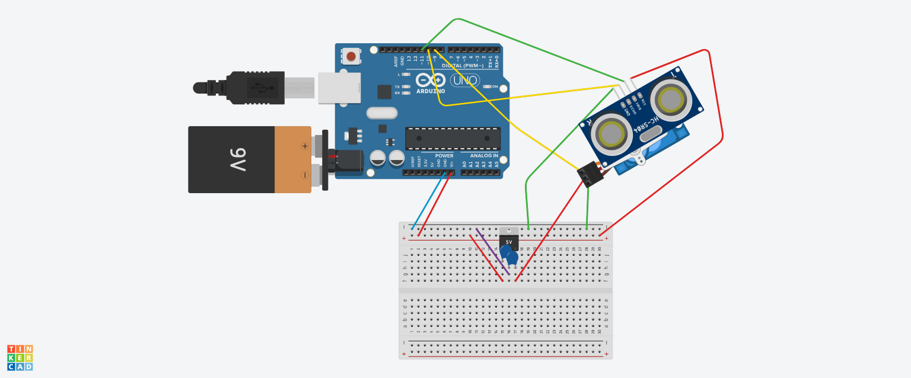

# 📡 Arduino Ultrasonic Radar
This project is an ultrasonic radar system built using an Arduino. It scans an area using a servo motor and an ultrasonic sensor to detect objects in its path, measuring the distance and angle of the detected obstacles and represent data with processing.

## 🚀 Key features
- 180-degree environmental scanning
- Real-time object detection and distance measurement.
- Visual representation using Processing

## 🛠 Hardware components
To replicate this project, you will need the following hardware:
- Arduino Uno (or compatible board)
- HC-SR04 Ultrasonic Sensor
- SG90 Micro Servo Motor
- Breadboard
- 9V Battery
- 2 Ceramic Capacitors 100$nF$
- LM7805 Linear Stabilizer (5V)
- Jumper Wires

## 🪚 Connection example

## 💻 Software & Libraries
- Arduino IDE: Used to write and upload the C++ code to the microcontroller.
- Servo.h: Standard Arduino library used to control the servo motor.
- Processing4: Processing used to visualize radar interface.

## 📟 How to Run the Project
1. Assemble the circuit according to the wiring guide above.
2. Connect the Arduino to your computer via USB.
3. Open the radar_mechanic.ino sketch in the Arduino IDE.
4. Select the correct COM port and Board from the Tools menu.
5. Click Upload.
6. Close the Arduino Serial Monitor if you have it open (if left open, it will lock the port and block Processing, MOST BUGS COMES FROM THIS ;) ).
7. Open your Processing sketch (.pde file) in the Processing IDE.
8. Ensure the COM port index in your Processing code matches your Arduino's port.
9. Click the Run button

## Lines 28 - 32 from radar_mechanic.ino explanation
As everyone should know from physics

$$v=\frac{s}{t}$$

so

$$s=v\cdot t$$

We know that $v\approx 343\frac{m}{s}$ (speed of sound)

$$343\frac{m}{s}=343\cdot \frac{100\text{ cm}}{1 000 000\text{ $\mu s$}}=0,0343\frac{cm}{\mu s}$$

The value of $t$ is known, because it's calcuclated by ultrasonic radar. For instance $t=~300\mu s$. Then

$$s=0,0343\frac{cm}{\mu s}\cdot 300\text{ $\mu s$} = 10,29\text{ cm}$$

We know that the distance is $10,29cm$ **but** we measured the time between radar and object **twice**. From radar to object, a sound wave bounced and returned back to radar. Due to this we have to divide our result by 2.

Our final distance is equal

$$\frac{s}{2}=\frac{v*t}{2}=\frac{10,29\text{ cm}}{2}=\boxed{5,145\text{ cm}}$$

## 🤖 AI usage declaration
AI was used for adding trail effect in the Processing visualization. All AI-generated code was reviewed, tested, and integrated
